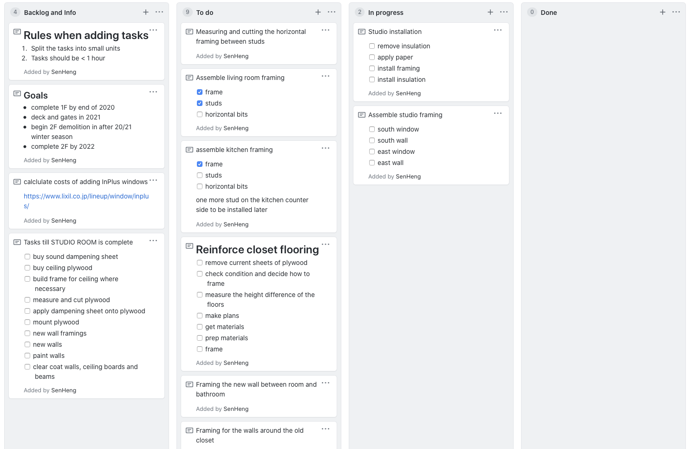

Now, I have separated tasks according to rooms (features in software) like living room, studio, kitchen. The problem here is that it makes it difficult to gauge when an entire series of tasks are complete. It's also difficult to prioritise tasks and decide which ones should come first.
