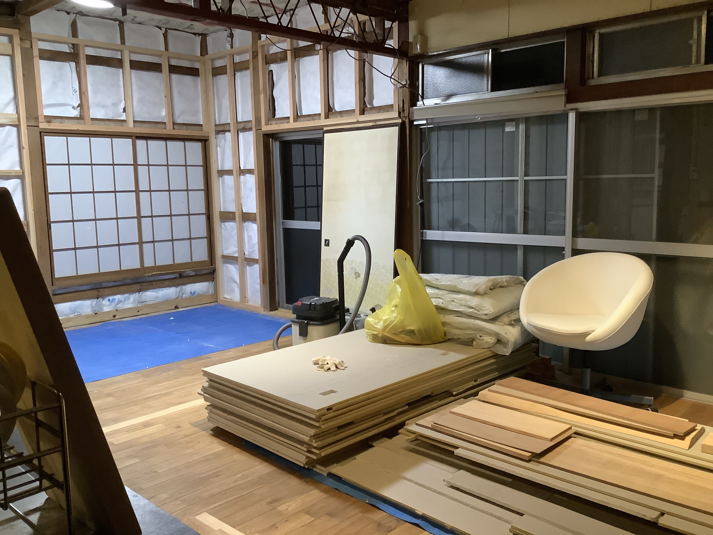

Things were getting a bit too messy with materials being left all over the place and I was having trouble finding a clear space to work with. On Saturday, Davide sorted my scrap wood into a nice pile in a corner and that gave me the idea of creating a dedicated work space.

I piled all my timber into the corner against the kitchen island, then moved all the used drywall from the studio out into the living room. The floorspace in the studio will now be my dedicated work space.
