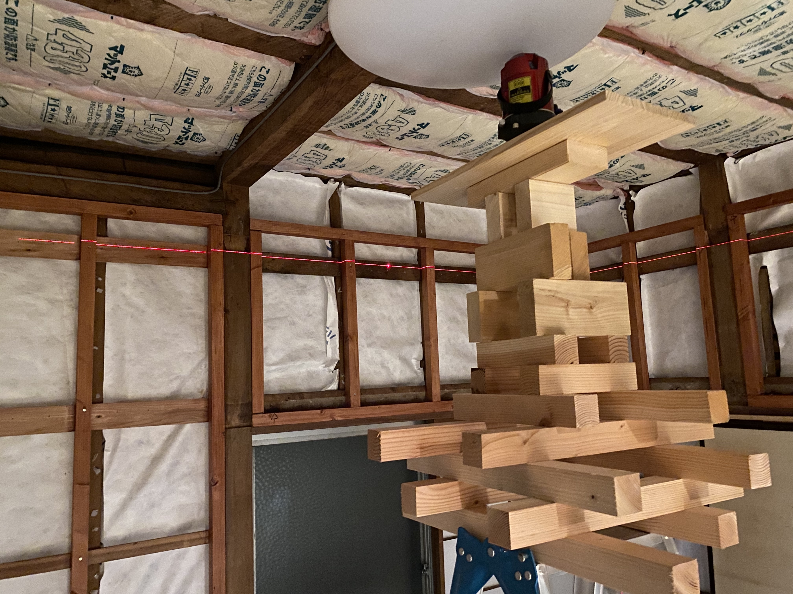
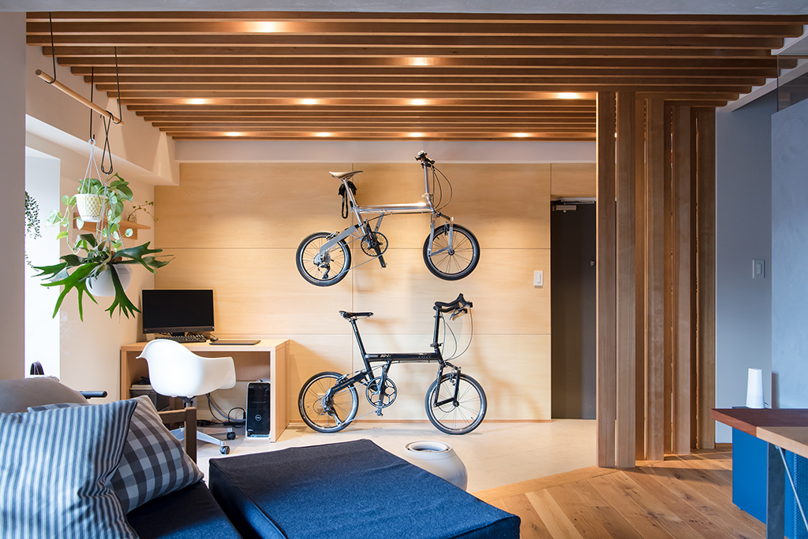
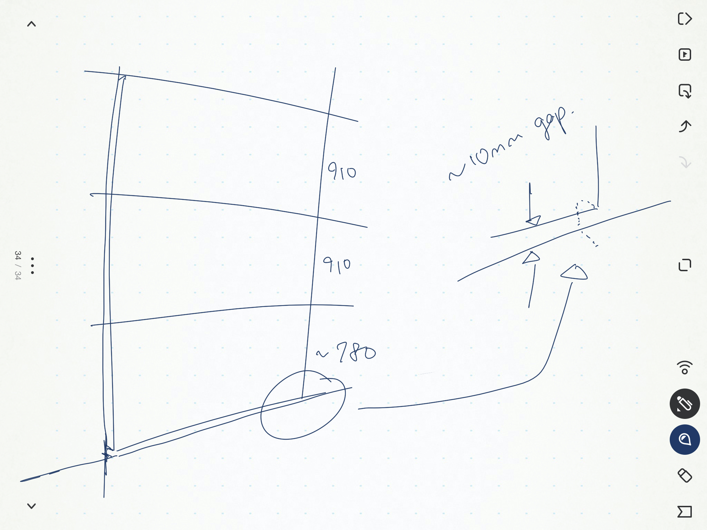
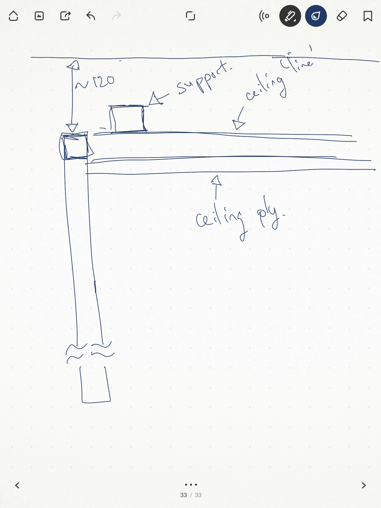

Continuing from a couple days back, I used a laser to mark out where the support frames for the ceiling would be installed to. Then called it a night, because tomorrow is a work day.

I didn't do anything on Sunday because the heat affected me more than I thought it would and I literally slept the day away. Literally _literally_. I slept around 2 or 3am and I woke up at 8pm. I got up, washed my face, drank a cup of milk, had one peice of chocolate and went straight back to sleep again, finally getting up past 10pm.

I did some thinking and planning about how I would mount the plywood panels for the wood, then more thinking and planning about how the ceiling mounts would go.

This is the look for the wall I'm attempting to achieve. The panels will be installed horizontally, there will be three panels stacked on top of each panel per section of wall.

As the wall is somewhere around 2600mm, the bottom panel will be trimmed and there'll be a slight 10mm gap between the wall and the floorboards.

This is more or less how the framing for the ceiling will be installed.
