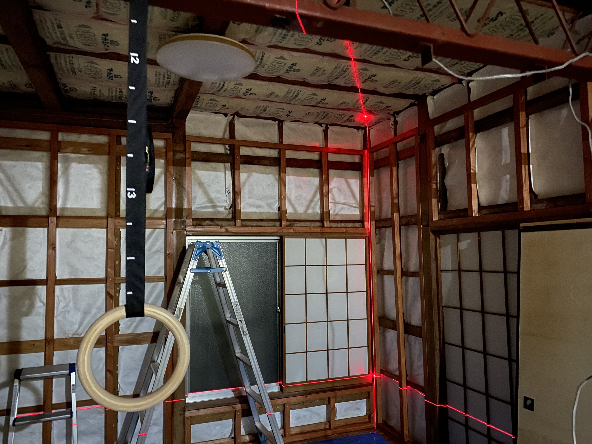

Not much today. Using the laser, I drew some lines down vertically, measuring from the ceiling line and marking out where the plywood panels would go. I was hoping to do the entire floor but it was too hot and stuffy and I couldn't bare to be in the area any more.

Also, I was planning to mark out the horizontal area of the plywood but my inkpot was dried out. Will do that another time too.

Here's hoping the heatwave over Japan ends soon.
